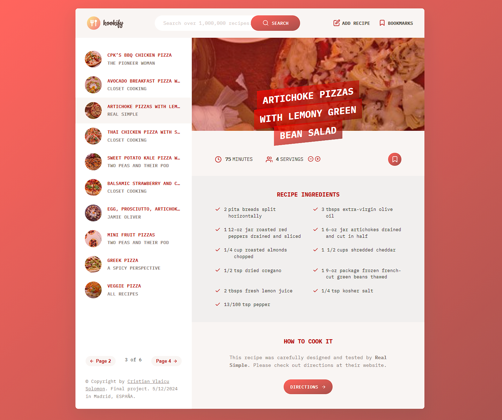
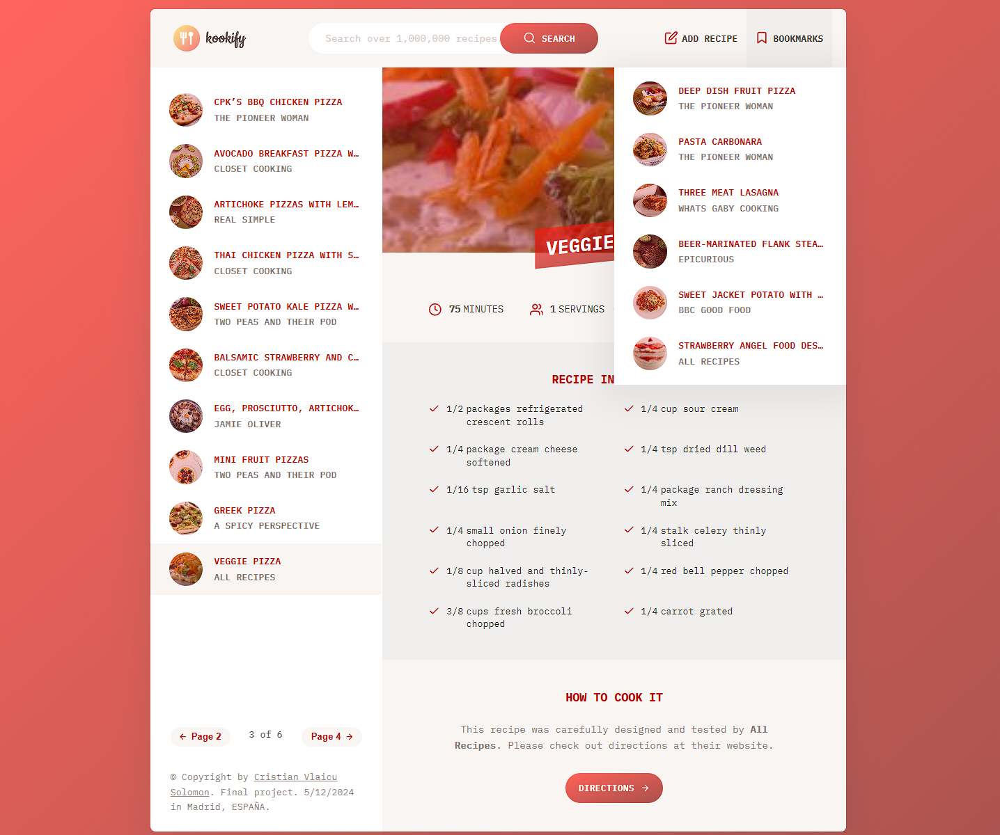
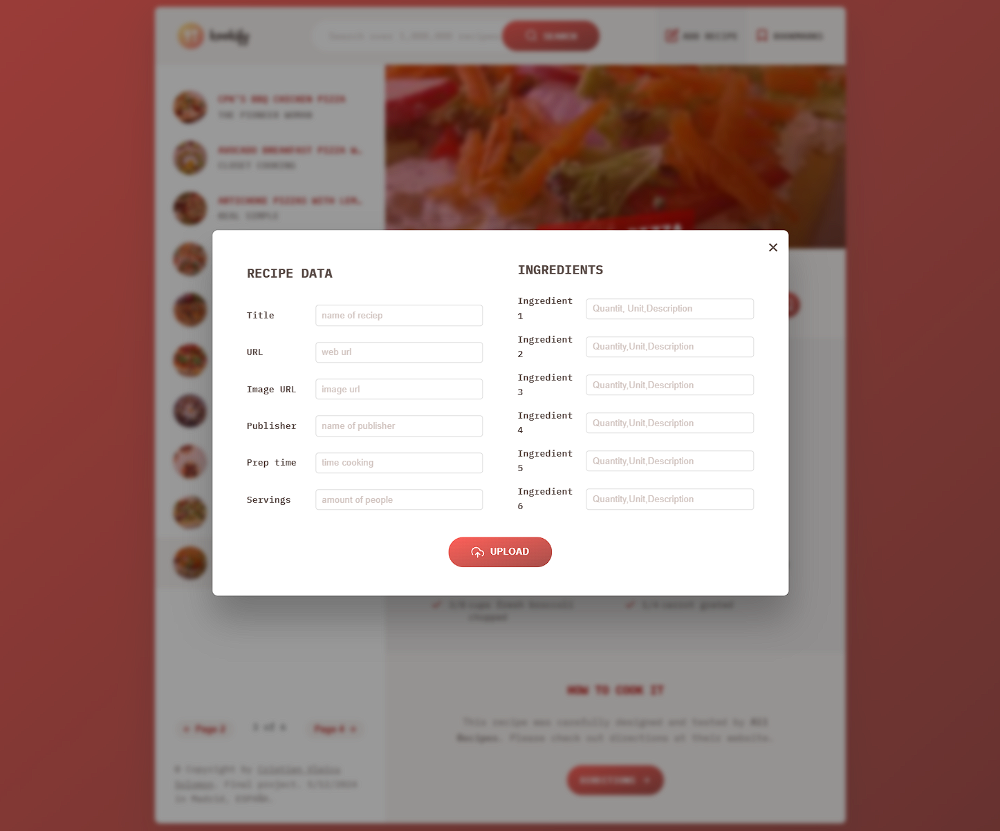
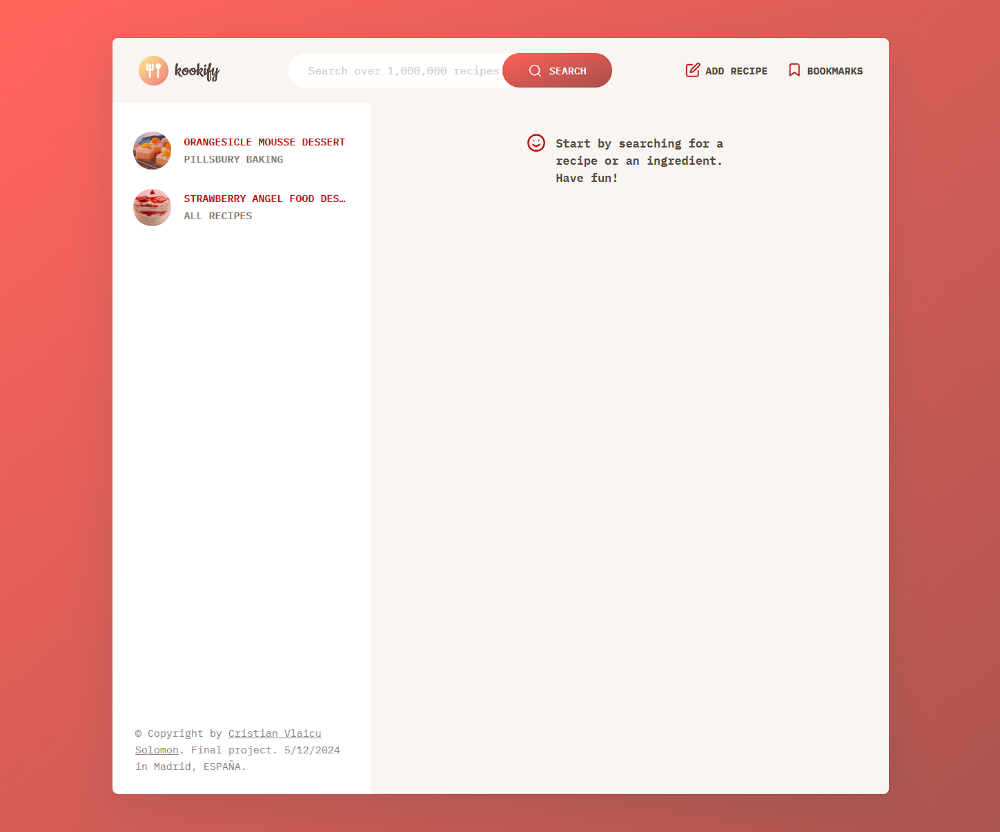

# What is this app?

<h3>
This is the mo** fuc** best and most complete web application I could make ever!! And that's it. Enjoy it...
</h3>

&nbsp;&nbsp;👉 Now serioulsly. This is a complete, advansed and beautiful web page, made in the most realistic way and in the most resemble to a real production web site. It is made in some files, each one for a determinate end and it is, finally, deployed in Netlify service, son you can see it in action with a real web page url, wich I will let it here:

  &nbsp;&nbsp;<a class="kookify_app" target="_blank" href="https://kookify-vlaicu.netlify.app/" ><b>https://kookify-vlaicu.netlify.app/</b>
  </a>

&nbsp;&nbsp;👉 All code files are commented as always to can follow the logic and understand what it is done in every step.

&nbsp;&nbsp;👉 This app (as the last 2 or 3 projects) is possible thanks to <b>Jonas Schmedtmann</b> and his amazing and complete JavaScript Course, on Udemy academy. Here is the link to that course, <a class="kookify_app" target="_blank" href="https://www.udemy.com/course/the-complete-javascript-course/" >https://www.udemy.com/course/the-complete-javascript-course/
</a>, in case someone want to learn or review the fundamental bases of JavaScript by making projects based on JS. One more time, thank you Jonas Schmedtmann and thank you Udemy.

&nbsp;&nbsp;👉 Obviusly you can clone the repository or download the zip folder of this beautiful project and use it as you wish.

&nbsp;&nbsp;👉 Here you have some screen prints to preview the web site:

&nbsp;&nbsp;👉The flowchart + architecture of the web app:

